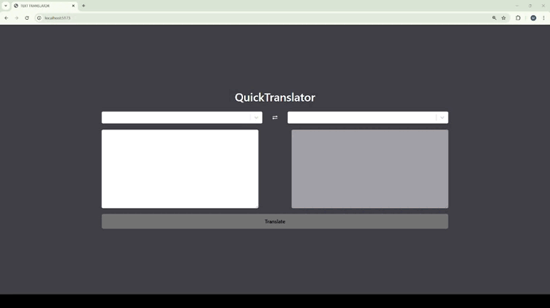

# QuickTranslator

In this project, I developed an interface that allows users to translate between languages. I used the features of Redux Toolkit and Redux Thunk.

# 🎯 Specifically the following features were used in this project:

✔️ Dynamic Use of Asynchronous and Synchronous Actions:

Both synchronous actions (e.g., selecting source and target languages) and asynchronous actions (e.g., API calls for text translation) were successfully integrated.

✔️ Dynamic Parameter Management:

Parameters used in API calls were dynamically managed with Redux's getState method, ensuring user preferences were considered at every step.

✔️Efficient State Management with Redux Toolkit:

A modern and clean state management approach was implemented, with robust error handling and efficient loading state management throughout the application.

# 💻 Technologies Used:

📍 Frontend: React.js

📍State Management: Redux Toolkit & Redux Thunk

📍API Communication: Axios

📍Translation Service: RapidAPI

# Preview of the Project

